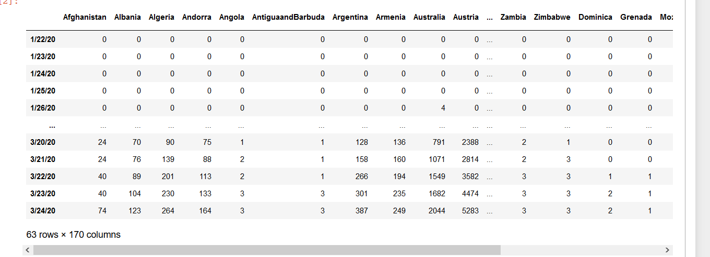
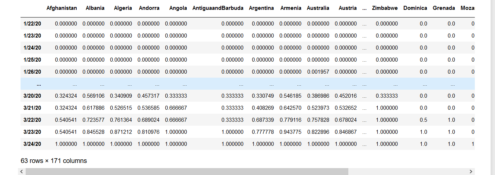
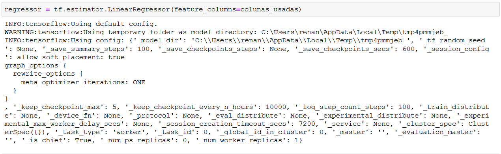
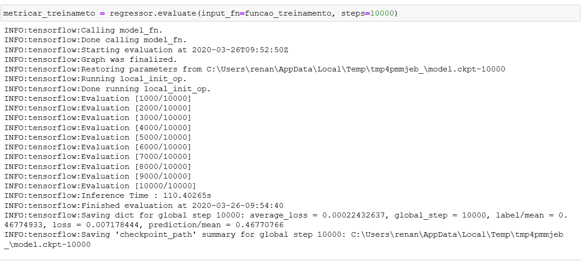
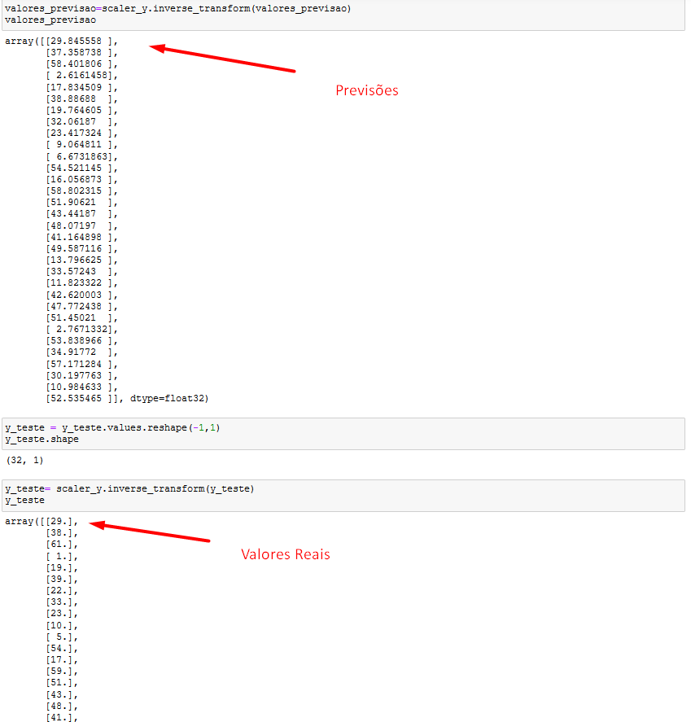

# Regressão Linear

> Código que implementa regressão linear utilizando Tensorflow para a previsão do dia de infecção tendo como base o número de novos casos relatados por 170 países em um intervalo de 63 dias.

## Sumário

  - [Tabela Formatada](#tabela-formatada)
  - [Escalonamento](#escalonamento)
  - [Regressão](#regress%c3%a3o)
  - [Treinamento](#treinamento)
  - [Previsões](#previs%c3%b5es)

## Tabela Formatada

O Primeiro passo foi extrair da tabela somente os dados que serão utilizados no treinamento.

## Escalonamento

Aplicação do escalonamento dos valores da tabela.

## Regressão

O `estimator` foi usado para aplicar a regressão linear nas colunas que continham os dados necessários.

## Treinamento

Criada a função de treinamento utilizando 10,000 steps.

## Previsões

Valores previstos após o treinamento em comparação aos valores reais.

